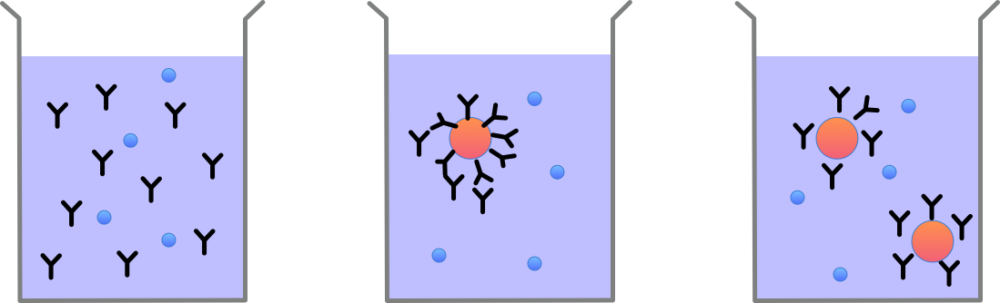

# Bioconjugate Reaction Kinetics

study on the kinetics of bioconjugates and its reactions

Goal: build a model that can predict the concentration of conjugated colloid in the case of the different antibody counts on a colloid

## Basic model

- number of antibodies: $N_a$
- number of biomarkers: $N_b$
- number of colloids: $N_c$
- number of colloid conjugates: $N_d$

Target: Total number of biomarker conjugated colloids
